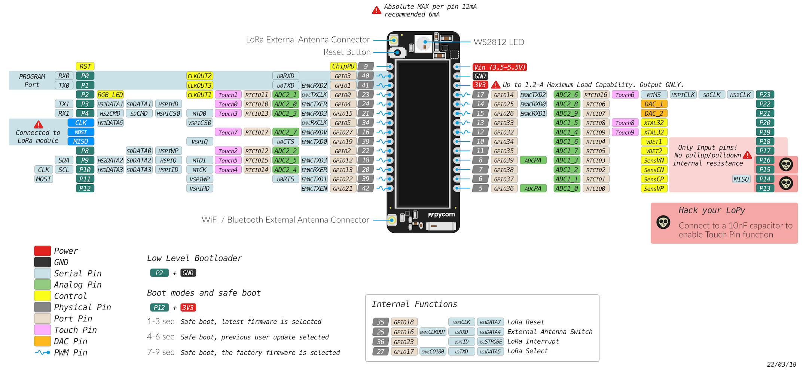
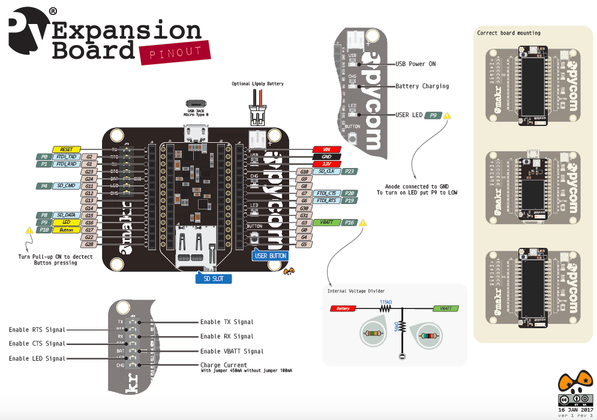
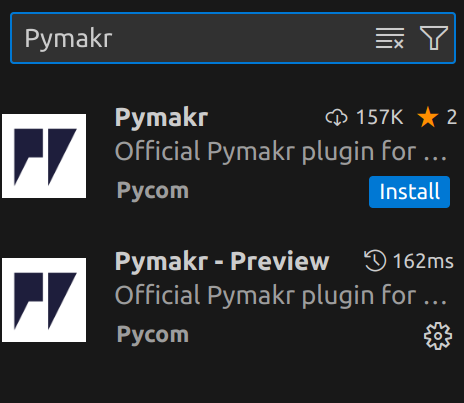

# Hardware
W naszym projekcie uzywamy plytki PyCom LoPy z Expansion Board v2. Do tego podpinany jest sensor dzwieku WaveShare.

## PinOuts

### PyCom LoPy

### Expansion Board v2

# Sposob podpiecia
Sensor     Plytka

GND --------> GND

VCC --------> 3v3

AOUT -------> G7

DOUT -------> nie ma to jakiegos znaczenia chyba

# Srodowisko programowania

## VS Code
Korzystam z VS Code z  pluginem PyMakr-Preview (bo wydaje mi sie ze dziala lepiej niz ich "stabilna wersja")

## Alternatywy
Niby jest jeszcze ATOM, mi nie dziala i z tego co wyczytalem to projekt przestal byc rozwijany.

Mozna sie zastanawiac nad arduino jeszcze ale wydaje mi sie ze Python w VS Code nam wystarczy.

## Sterowniki
Na MAC OS wszystko powinno zadzialac "Out of the box". Na Windowsie 8/10/+ tez. Dla Windowsa 7 trzeba pobrac sterowniki.

https://docs.pycom.io/gettingstarted/software/drivers/

Na Linuxie trzeba dodac uzytkownika do grupy **dialout**, a nastepnie zrestartowac system (innego rozwiazanie nie znalazlem)

## Jak rozpoczac projekt?

Wybierz folder and thats it.

Sa 3 pliki: boot.py, main.py, pymakr.conf

Piszemy glownie w main.py

//TODO: ogarnac co robi boot.py i czy nam jest porzebny

pymakr.conf to config to VS Code wiec zostawiamy go w spokoju.